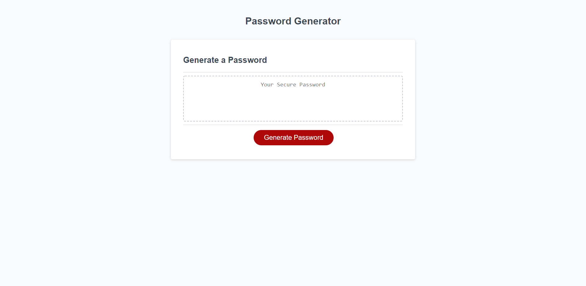

# 03-javascript-homework

# Homework 3

## Description of my work:

* When opening the page, you are presented with a screen and button to generate password.

* When the "Generate Button" is clicked, there is a prompt to determine password length. There is a hard stop if the user doesn't choose a length between 8 and 128 characters.

* The user is then prompted for which types of characters they would like in their password. If the user doesn't choose any character types, there is a hard stop.

* When the user selects appropriate criteria, a password with their chosen options is displayed.

## Link to Website
https://rlacer.github.io/03-javascript-password-generator/

## Screenshot

